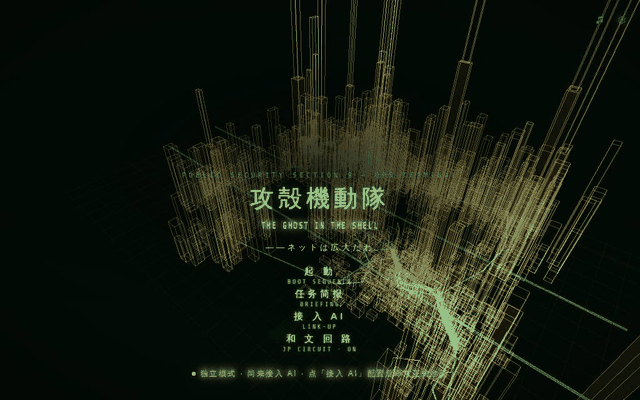
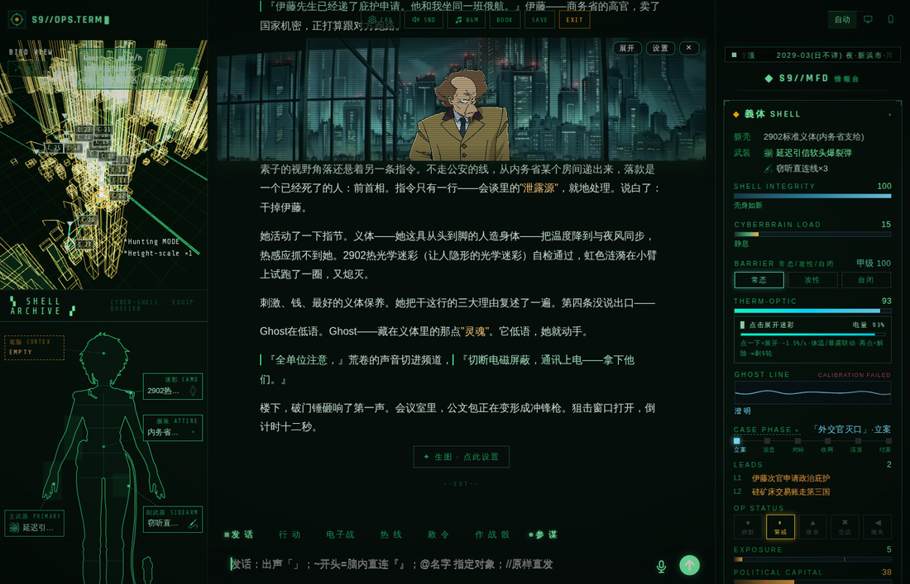
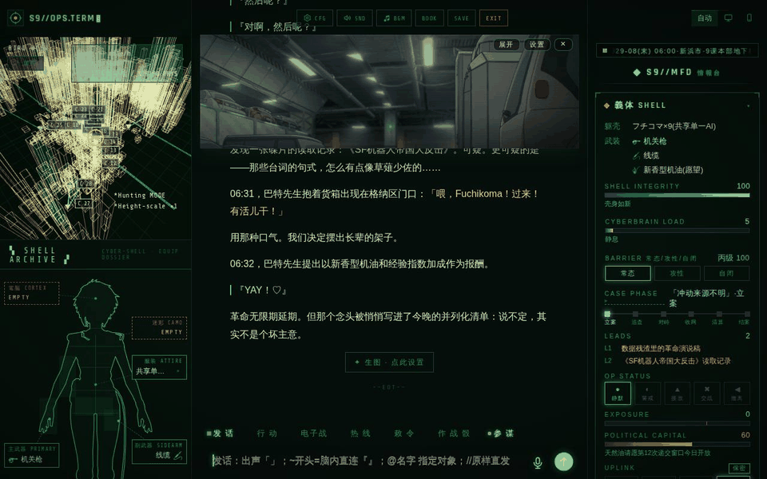
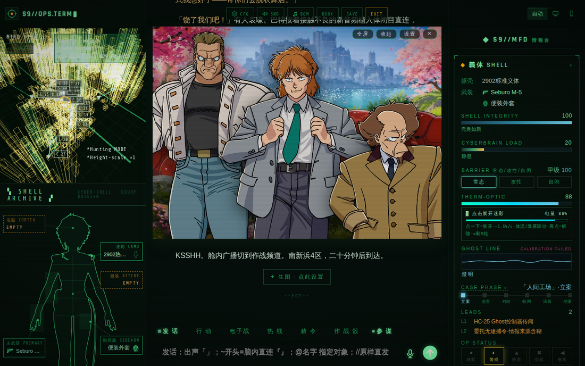
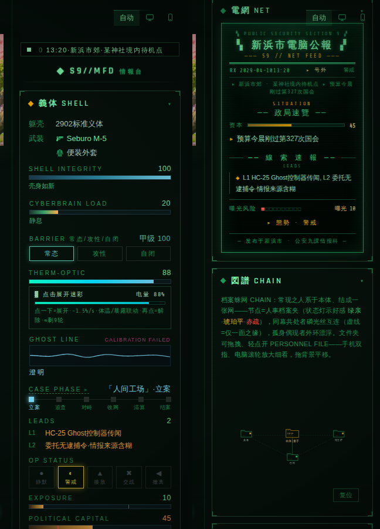
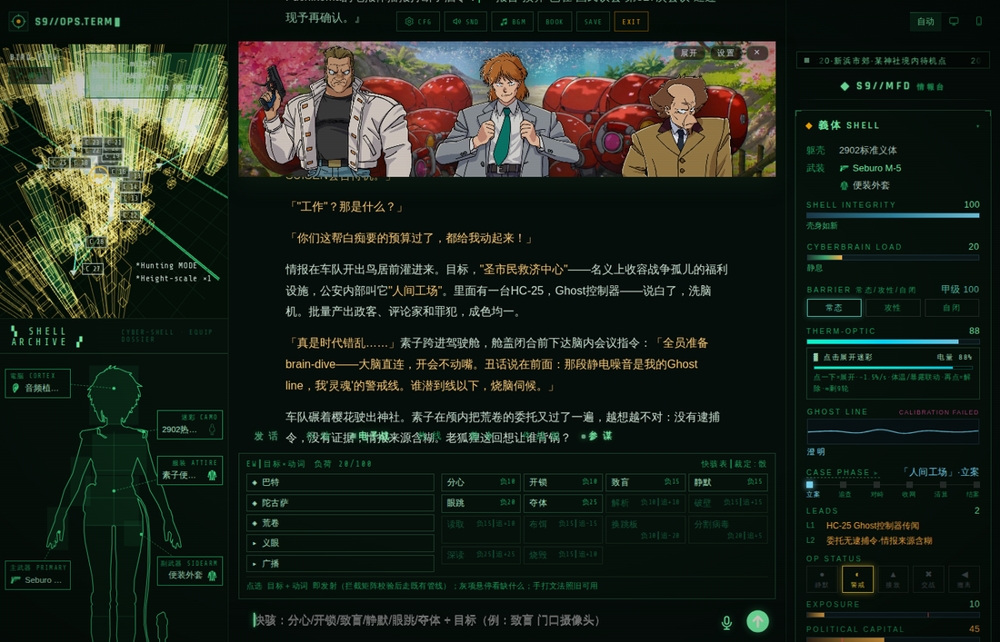
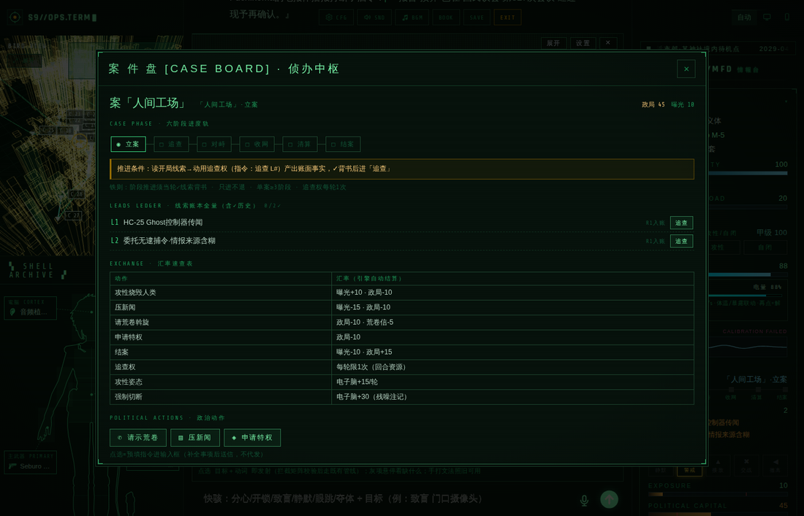
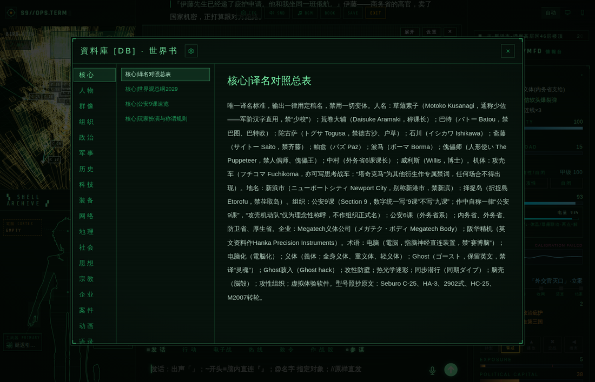
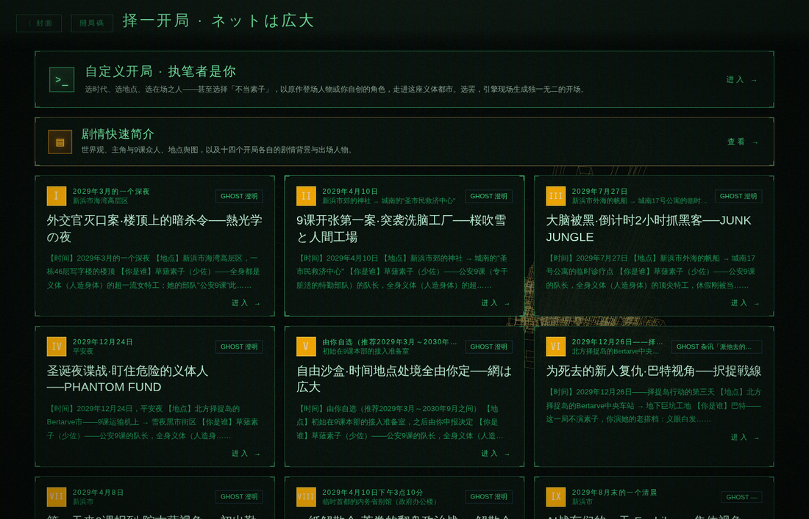

# 攻殻機動隊

**THE GHOST IN THE SHELL · 你即草薙素子 · 公安9课与整个电脑化时代由 AI 扮演**

*一款免安装的 AI 文字角色扮演游戏 —— 忠于士郎正宗原作漫画与 2026 新动画*

---

> 2029年，新浜市。第四次大战的硝烟散尽，人的意识可以化为数据，义体比血肉更常见。
>
> 你是公安9课的草薙素子少佐——全身义体的电子战王牌。案件、政争、潜入、网络深潜，太平洋沿岸这座城市的每一条回线都可能通向真相，或通向你自己的 Ghost。

## ✦ 起動 —— 程序化建城封面

打开游戏的第一眼：一座新浜市从空网格上逐栋生成，琥珀线框楼群、干道与航线在十几秒内建成一座完整都市，循环往复。封面与选局页背后是同一套实时 3D 渲染，非预渲染视频。

## ✦ S9 OPS.TERM 作战终端

进入游戏即是三栏作战全景：左栏 3D 战术地图 + 素子人体装备图，中栏正文，右栏 SHELL-DIAG 情報台。

- **3D 战术地图**：1995 剧场版导航图风格的线框城市，30 个正典地点实时标绘。玩家位置随剧情◇时地自动移动，案件地点琥珀脉冲，点击节点即可下达移动指令；潜入网络层时整图换极性。渲染失败自动降级与自愈，永不卡死
- **素子人体装备图**：以人体轮廓为界面的装备系统——主武器/副武器/迷彩/服装各部位槽位直接落在身体对应位置，背包为格状收纳；热光学迷彩有独立电量条，展开/收拢实时结算。装备账目每轮跟随剧情面板自动增减
- **SHELL-DIAG 情報台**：义体完整度、电子脑负荷、防壁三态、迷彩电量、Ghost 波形（永远校准失败）、案件六阶段轨、线索账本、作战状态一板俱全，每轮实时结算；剧情时地以跑马灯常驻首排
- **電網 NET 公报**：CRT 磷光屏质感的新浜市电脑公报，随政局/曝光/态势生成当日头条

## ✦ 影像岛 —— 视觉小说系统

灵动岛即舞台：2026 新动画官方全身立绘，谁在场谁登场。

- **像素显形进场**：角色以逐格像素块随机显形登场（与官方网站角色页同款特效参数）
- **场景自动匹配**：43 张场景图按剧情◇时地逐轮匹配切换——神社花见、湾岸高速、地下格纳区、择捉雪夜，走到哪演到哪
- **导演系统**：纯规则的内置调度——在场之人决定立绘进出场与站位（1/2/3 人自动布位）、身高比例归一、机体角色豁免人像特写、背景滞回防闪切
- **三档取景**：小窗半身特写 / 展开及膝 / 全屏全身，随岛状态自动切换

## ✦ SHELL-DIAG 情報台 —— 逐键说明

自上而下（每一项都随剧情逐轮实时结算，各栏标题点击可折叠/展开）：

| 区块 | 功能 |
|---|---|
| **时地跑马灯** | 当前剧情的日期·地点滚动常驻首排 |
| **躯壳 / 武装** | 当前义体型号与手持武器清单，随剧情面板每轮增减 |
| **SHELL INTEGRITY** | 义体完整度 0–100，中弹损毁直接掉条 |
| **CYBERBRAIN LOAD** | 电子脑负荷——电子战动词、并行思考都要扣负荷，过载有惩罚 |
| **BARRIER 三键** | 防壁姿态切换：**常态**=均衡防御；**攻性**=反杀入侵者但每轮+15负荷；**自闭**=物理切断一切外联，最安全也最聋（+30负荷·留残噪注记） |
| **THERM-OPTIC** | 热光学迷彩电量条。**点一下=展开**（-1.5%/秒·体温景深联动），**再点=解除**；电量耗尽自动失效 |
| **GHOST LINE** | Ghost 波形（永远 CALIBRATION FAILED——Ghost 不可校准）。下方状态字：澄明 / 低语 / 杂讯，低语即伏笔 |
| **CASE PHASE ▸** | 当前案件与六阶段进度轨，**点击打开案件盘**（详见下节） |
| **LEADS** | 线索账本：L1/L2… 逐条列出已获线索 |
| **OP STATUS 五键** | 作战姿态一键切换：静默 / 警戒 / 接敌 / 交战 / 撤离——直接写入下一轮的◇态势 |
| **EXPOSURE** | 曝光度——行动闹大了会涨，涨满上新闻 |
| **POLITICAL CAPITAL** | 政治资本——请示荒卷、压新闻、申请特权都要花它 |
| **電網 NET** | CRT 屏风格的新浜市电脑公报，随政局/曝光生成当日头条 |
| **図譜 CHAIN** | 人物关系蛛网图：出场人物结成引力网，点选查看关系与心向 |
| **記録 LOG** | 编年时间轴，全部剧情大事自动归档 |
| **記憶 MEM** | 长程记忆条：AI 自动提炼+手动钉选，跨越上下文长度保持人设与伏笔 |

### 核心指标详解

**GHOST LINE（Ghost 波形）**
Ghost——藏在义体里的那点"灵魂"——的实时波形，右上角永远写着 `CALIBRATION FAILED`：Ghost 无法校准，这是设定也是宣言。波形分五档，档位由剧情驱动、不可手动：

| 档 | 波形 | 含义 |
|---|---|---|
| 澄明 | ▁▂▁ | 直觉在线，一切如常 |
| 低语 | ▂▄▂ | Ghost 在提醒你什么——**每一次低语都是伏笔契约**，之后必有回收 |
| 杂讯 | ▄▆▄ | 有东西在干扰你的直觉，可能是入侵前兆 |
| 紊乱 | ▆█▆ | 电子脑或 Ghost 正被撼动，立刻处理 |
| 断线 | ──── | 感知不到自己的 Ghost。最坏的状况 |

**CYBERBRAIN LOAD（电子脑负荷预算）**
0–100 的回合资源，一切并行运算都从这里扣账：电子战动词按价扣（分心 10、眼跳 20、夺体 25……）、攻性防壁每轮 +15、自闭切断一次性 +30、脑内多线程会议也计税。档位：**0 静息 → 40 多线程 → 80 过热! → 100 强制掉线**。数值变动有渐变限幅（引擎强制，AI 不能一轮清零或打满），所以要提前规划：负荷高企时先收动词、关攻性，等它按轮回落。

**BARRIER 三态（常态 / 攻性 / 自闭）**
防壁是电子脑的城墙，三态一键切换、立即写入下一轮：

- **常态**——均衡防御，零维持费。日常巡航档
- **攻性**——反杀模式：入侵者会被烧穿反噬，但维持费**每轮 +15 负荷**，还会让谈判对象紧张
- **自闭**——物理切断一切外联：绝对防御的同时你也聋了瞎了（队内通讯全断），切断动作一次性 **+30 负荷**并留下残噪注记；深潜中强制切断另有代价

**OP STATUS（作战姿态五键）**
一键改写下一轮的◇态势，五档信号灯：**● 静默**（绿，无声待机）→ **◐ 警戒**（黄，武器上膛）→ **▲ 接敌**（橙，目视敌人）→ **✖ 交战**（红，自由开火）→ **◀ 撤离**（紫，脱离战斗）。态势影响 AI 的叙事节奏与敌我反应，也和曝光联动——静默潜入闹出交战，EXPOSURE 必涨。

**POLITICAL CAPITAL（政治资本）**
9课不是超法机关，是**有预算科目的政府部门**。政治资本就是你在永田町的账户余额：请示荒卷斡旋 -10、压下一条新闻 -10（曝光 -15）、申请特权 -10、漂亮结案 +15。数值条下方一行小字实时播报政治动向（省厅照会、预算审查、请愿窗口……）。资本见底时，连荒卷也保不住你——政治上破产比义体报废更致命。

**UPLINK（回线状态）**
你此刻的通信线路走的是什么，决定了谁能听见你：

| 灯 | 线路 | 安全性 |
|---|---|---|
| ▣ 面对面 | 出声说话 | 在场者皆可闻 |
| ○ 无线 | RF 电波 | 方便，但**可被监听定位**（择捉那种旧式电脑都市=裸奔） |
| ◉ 光纤 | 物理铺线 | 防监听的行动标配 |
| ◈ 直连 | 线缆入颈 | 脑对脑，最私密也最亲密 |

回线遭敌方分接时会先标**疑似分接**、坐实后转**已分接**——此时你输入的每个字都是敌人窃听的内容，**放饵协议**由此展开：明知被听，故意喂假情报，将计就计。

## ✦ 电子战 —— 怎么玩

底部行动栏切到**电子战**模式，面板分两栏：左=可选目标（在场人物 / 设备 / 广播），右=动词表。

1. **点目标 + 点动词，即选即发**：动词按负荷标价（分心 负10 / 眼跳 负20 / 夺体 负25……），发射后自动扣 CYBERBRAIN LOAD、涨追踪计
2. **表层快骇 6 动词**：分心 / 开锁 / 致盲 / 静默 / 眼跳 / 夺体——不用潜入，站在物理层直接骇（例：`致盲 门口摄像头`）
3. **深潜动词**：解析 / 破壁 / 读取 / 布饵 / 换跳板 / 分割病毒 / 深读 / 绕毁——须先切入网络潜入层（现实层翻转，整个界面换极性），威力更大、代价与追踪也更高
4. **裁定**：每次入侵走判定骰，界面标注当前**裁定面**与失败面；灰色悬停会提示还缺什么前置
5. **防守侧**：被人骇进来时进入**防壁迷路**小游戏，限时走出迷宫保住 Ghost；回线被分接时你打的每个字都会被敌方窃听——**放饵协议**：故意喂假话，将计就计

手打文法照旧可用：不点面板，直接在输入框打 `动词 目标` 也能发射。

## ✦ 案件盘 —— 怎么玩

情報台点 **CASE PHASE ▸** 打开侦办中枢，一案一盘：

1. **六阶段进度轨**：立案→追查→对峙→收网→清算→结案。铁则：**阶段推进须当轮有✓线索背书、只进不退、单案≥3阶段**——禁一轮破案
2. **LEADS LEDGER 线索账本**：每条线索带入账轮次，点右侧**「追查」**直接预填追查指令（追查权每轮限 1 次，是回合资源）
3. **EXCHANGE 汇率速查表**：每个大动作明码标价——攻性烧毁人类=曝光+10·政局-10；压新闻=曝光-15·政局-10；结案=曝光-10·政局+15……闹多大、赔多少，先看表再动手
4. **POLITICAL ACTIONS**：请示荒卷 / 压新闻 / 申请特权三个政治动作，点选即预填指令（花的是政治资本，不代发）
5. 结案后自动生成**结案报告书**归档

## ✦ 其他玩法系统

- **行动四模式**：发话 / 行动 / 电子战 / 敕令。发话支持 `「」`出声与 `『』`脑内直连两轨，`@名字` 指定对象
- **三骰裁定**：作战骰、GHOST 直觉骰、入侵判定骰，五档结果严格裁定成败

## ✦ 世界书与剧透锁

内嵌 891 条设定条目（人物 / 案件 / 科技 / 政治 / 地理 / 语录……），每轮按关键词、在场人物、当前地点、案件进度与玩法模式六层规则精准注入。

- **时间线剧透锁**：图鉴与注入都严格按当前剧情时点解锁——2029 年的你查不到 2030 年才登场的存在；玩到哪，图鉴长到哪
- **口语别名索引**：喊"老狐狸"就是荒卷，说"攻壳车"就是フチコマ，异体字（択捉/择捉）同样命中

## ✦ 十四个开局

素子视角为主（含办公室日常与自由沙盒），另有巴特、陀古萨、荒卷乃至フチコマ集体意识视角。每个开局配新手导览：时间、地点、你是谁、现在的局面、你可以做什么——没看过原作也能三十秒上手。

## 怎么玩

游戏本身**不自带 AI**，你接入自己的 AI 接口来驱动世界：

1. 打开在线地址（或用浏览器打开本仓库的页面文件）。
2. 在「接入 AI」中填入你自己的接口地址与密钥（OpenAI / Anthropic / Gemini 兼容格式均可）。
3. 选一个开局，开始。

存档、记忆、密钥等一切数据仅存于你的浏览器本地，不上传、无服务器、无数据库。

- **日文沙盒**：可选让 AI 以日文构思草稿再译出中文正文，还原日译中漫画质感；执笔过程以半透明和文实时叠写在影像岛上
- **酒馆生态兼容**：SillyTavern 角色卡（PNG/JSON）、世界书高级字段、正则脚本、预设导入

## 原作与素材

士郎正宗《攻殻機動隊 THE GHOST IN THE SHELL》（講談社）；2026 动画《攻殻機動隊》（Science SARU）。本作为同人作品，仅供学习交流，与上述权利方无任何关联。部分界面图标来自 [game-icons.net](https://game-icons.net)（CC BY 3.0）等开源图标库。

## 免责声明

- 本项目为**纯前端静态页面**，不内置、不提供、不转售任何人工智能服务，亦不代理任何第三方 AI 接口。
- 玩家自行接入的第三方 AI 服务，其配置、费用、可用性及**由此生成的一切内容**均由玩家本人负责，与本项目及其维护者无关。
- 所有游戏数据（存档、密钥、记忆）仅保存在玩家本地浏览器中；本项目不收集、不存储、不传输任何用户数据。
- 游戏内文本由玩家接入的 AI 实时生成，不代表本项目立场。

## License

见 [LICENSE](LICENSE)。代码开放、禁止商用；原作相关名称与设定的权利归属其各自权利方。
